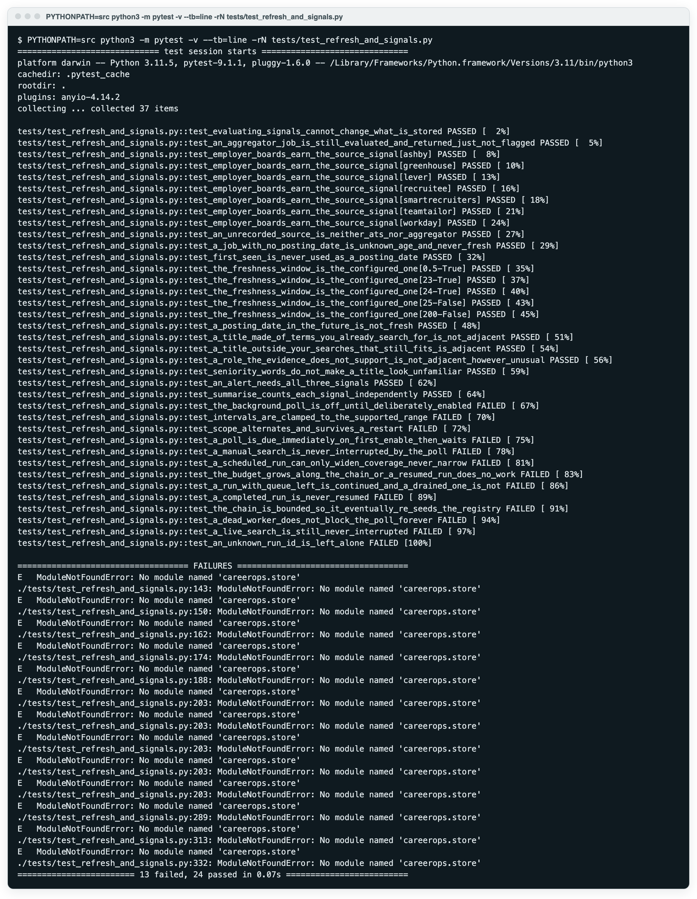

# Before Coffee

A daily email of jobs you would otherwise miss. It collects vacancies from employer job
boards around the clock, picks the ones that fit using fixed rules you can inspect, and
sends a single plain-text email at 07:00.

The email is the least interesting part. What this repository is really about is the
decisions behind it: a model I specified and then chose not to build once I'd measured
the data, and three failures that no dashboard would have caught.

*A real offline run of this repository's own tests on invented data: the 24 signal tests pass, and the 13 scheduler tests fail on `import careerops.store`, which isn't in this extract ([raw output](docs/images/signals-tests.txt)).*

## System architecture

*Purple: model call · blue: deterministic code · green: human · amber: evaluation · grey: storage · dashed: external, optional, mocked or planned*

Every hour, `RefreshLoop` in `refresh.py` asks the private web app for a collection run, resuming the previous run's checkpoint while its queue has work, and the collector writes new vacancies into a SQLite store. At 07:00 a launchd job runs `digest_cli`, where `digest.select` skips roles in the sent ledger, keeps those with a strong or plausible fit band in a configured location, tags each with the three signals from `signals.py` and caps the list at 25. `digest_delivery` then sends one plain-text email to the mailbox Gmail reports as authenticated and records the sent IDs. The boxes marked "not in repo" and the location classifier (`inventory.classify_job`) live in the private system (see [What is and isn't here](#what-is-and-isnt-here)).

## Does it use AI at runtime?

No: nothing in this code calls a model, selection uses fixed rules and three deterministic signals (see [How selection works](#how-selection-works)), and the contextual bandit from finding 1 was measured and deliberately not built. The fit band that selection filters on is read from the store, and the private code that computes it isn't in this repository.

---

## What it does

- **Collects** vacancies every hour from employer applicant-tracking boards (Greenhouse,
  Lever, Ashby) and other public sources.
- **Selects** roles that match the candidate's recorded evidence and configured locations.
- **Sends** one email: a **London** section, then an **International** section, with each
  role followed by the reason it was picked.
- **Never** shows a match percentage, never claims to know your chances of an interview,
  and contains no tracking pixel, link shortener or redirect.

---

## Decisions and findings

### 1. I specified a contextual bandit, measured the data, and decided not to build it yet

The plan was to learn from how the reader responds to each digest. Before writing a
learner, I measured what it would actually be learning from.

**The labels are positive-unlabelled.** There were 215 historical positives (roles marked
"saved") and **zero** explicit negatives. The other ~2,600 roles are *unlabelled*, not
rejected. Treating them as negatives biases the model towards whatever the old interface
happened to show.

**The history can't be evaluated off-policy.** Those saves were collected under a policy
that never recorded propensities, so no inverse-propensity estimate built on them is
honest.

**A status-based reward would have been contaminated by source.** This is the number
that settled it:

| Source of role | Qualifying | Already acted on |
|---|---:|---:|
| Legacy import | 80 | 77 (**96%**) |
| Live employer boards | 258 | 4 (**2%**) |

A learner rewarded on job status would have latched onto a stale legacy import within a
week and written off live listings. Every offline metric would have said it was
improving the whole time.

**There is barely anything to allocate.** On the one full night I measured, 18 new roles
qualified against a daily cap of 25. Once the backlog clears, every qualifying role ships
the day it arrives, and a bandit ends up choosing from a single option.

**So the measurement layer comes first:** log every impression with its propensity and
its features *as they were at send time*; collect labels by replying to the digest, so no
tracking is needed; and hold out a fixed control policy so it's possible to tell whether
learning helps at all. Nothing gets fitted until there are enough labels to evaluate it
honestly.

### 2. A collection bug that every metric reported as healthy

The hourly collector restarted from scratch on each run. Because the order it visited
boards in never changed, every run hit its time limit in the same place:

- a fresh run reached **5 of 62** employer boards before stopping at 180 seconds, and
  dropped a queue of 256 more;
- two separate London runs contacted **exactly the same eight hosts** with identical
  per-host counts, and the second stored **zero** new roles;
- one ATS provider was never contacted at all, and another got a single request across
  24 boards.

The store never shrank, so every count looked fine while most of the reachable inflow had
quietly stopped arriving. I found it by comparing per-host request counts across runs,
not from a dashboard.

**The fix** was to resume each run from the previous checkpoint. That needed two further
changes. A resumed run starts with its elapsed time already charged against the budget,
so its budget has to grow as the chain goes on (`consumed + slice`). And every coverage
limit is written with `max()` against what's already configured, so a scheduled run can
widen coverage but never narrow it. A test asserts that.

After the fix, new roles per run went from **0** to 517, 843 and 1,154, and the pool grew
from 1,638 to more than 3,000 roles.

### 3. A cleanup step that never ran

After a crash, the collector stopped polling for **55 minutes**, even though its own
"is a poll due?" check kept answering yes.

The worker cleared its "search running" flag in a `finally` block, but the *first*
statement in that block raised `database is locked`. That aborted the rest of the
`finally`, the flag was never cleared, and every later poll decided a search was still
running and backed off.

The loop now clears flags whose stored run status is already terminal. It only discards
a flag when that status is *positively* terminal. If a run is unknown, or the store can't
be read, the flag stays put, because skipping a poll for an hour does far less harm than
two searches running over one database. The regression test was checked to **fail**
without the fix before I kept it.

### 4. Scores that rewrite themselves

Opening the job store recalculates and rewrites every role's fit score. So a score read
today is not the score the reader saw last week. Any impression log therefore has to
store features as they were at send time rather than pointing back at the store. This is
also why the log will be an append-only file and not a database table.

A related trap: opening the store also takes a SQLite *write* lock. Switching to WAL
stopped readers from blocking the collector, but it doesn't stop one writer blocking
another. Inspection tools use read-only connections for that reason.

### 5. A filter that would have quietly lost data

The first design selected "roles first seen since the last digest". With a daily cap,
that loses data: roles held back by the cap were first seen *before* the digest that
couldn't fit them, so the next digest's time filter dropped them for good. Meanwhile the
email promised they would "appear in the next digest".

A ledger of the IDs already sent replaced the time filter. It excludes exactly what's
been shown and nothing else, and a test checks that a held-back role turns up the next
day even when nothing new has been collected.

### 6. A permission that cannot widen itself

This system sends exactly one kind of message: a digest to its owner's own mailbox. That
rule is enforced in code, not just stated in a document:

- The recipient defaults to the **authenticated mailbox itself**, which it gets from the
  Gmail profile at send time rather than from configuration.
- Sending to any other address raises an error unless that has been explicitly enabled.
- It **cannot start a browser consent flow on its own**. An unusable token produces an
  error that tells the owner what to do, instead of an unattended hang at 07:00.
- No attachments, no tracking, and an empty digest is simply not sent.

---

## How selection works

There's no model in the selection path. Each role gets three deterministic signals, and
each email line comes with the reason that applied:

| Signal | Fires when |
|---|---|
| **Source** | the role is on the employer's own board rather than an aggregator |
| **Fresh** | the employer's own posting date falls inside the window |
| **Adjacent** | the role meets the criteria, but its title isn't one the configured searches would have found |

*Adjacent* is what produces "a job you'd have missed". *Fresh* has turned out to be
almost unused: fewer than half the qualifying roles carry a posting date at all, and the
date a role was first *seen* is never treated as a posting date.

---

## Tests

70 tests, all using invented data. Tests written against real personal data end up being
tests about a person, and they would leak that data into the repository.

The tests cover properties rather than examples:

- the email never contains a percentage, a score, or a claim about someone's chances;
- a hostile job title can't inject headers or control characters;
- the digest refuses any recipient other than the authenticated mailbox unless that is
  explicitly enabled;
- an unusable token raises an error and never opens a consent flow;
- a role held back by the cap turns up in the next digest;
- a scheduled run can widen collection coverage but never narrow it;
- a crashed worker can't block polling forever, and a live search is never interrupted.

---

## What is and isn't here

This code was extracted from a larger private system. The job store, the location
classifier, the collector and two small Gmail helpers aren't included, because they're
built around personal data. **So this repository is for reading, not for running:** the
modules and tests are complete and documented, but they import code that isn't here.

| Path | What it is |
|---|---|
| `src/careerops/digest.py` | selection, sectioning and the plain-text email |
| `src/careerops/digest_delivery.py` | self-only delivery and the recipient guard |
| `src/careerops/digest_cli.py` | the entry point the 07:00 schedule runs |
| `src/careerops/signals.py` | the three selection signals |
| `src/careerops/refresh.py` | the hourly collector loop, continuation chain and flag cleanup |
| `scripts/digest_ingestion_census.py` | proves collection coverage never shrinks |
| `scripts/install_digest_schedule.sh` | installs the 07:00 job as a macOS LaunchAgent |
| `scripts/reauthorise_gmail.py` | recovers Gmail access when a token dies |
| `tests/` | the 70 tests described above |

---

## Status

Running daily. Next up is the measurement layer from finding 1: impression and
propensity logging, and reply-based labels. The learner comes after that, and only once
the labels can support an honest evaluation.
